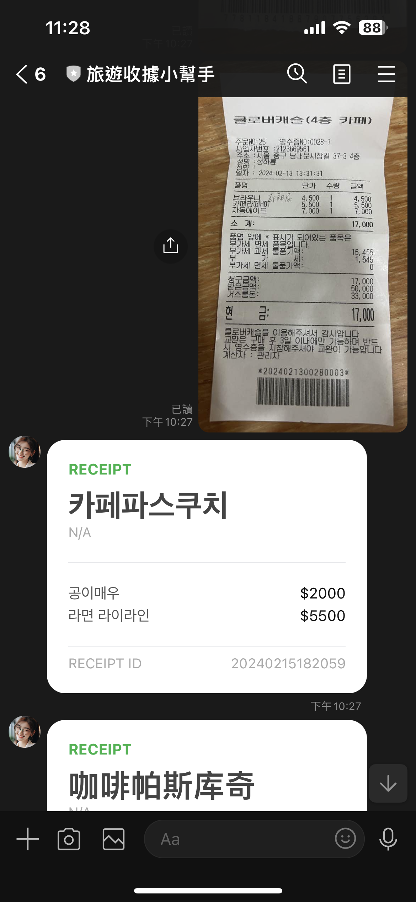
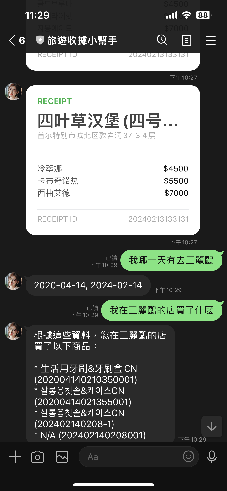

# Receipt Helper

A handy tool for travelers who struggle with understanding the content of receipts in foreign languages. This tool was created out of the need to keep track of expenses during travel without the barrier of language. It allows users to scan receipts, extract information, and translate it for easy accounting and future reference.

## Project Background

While traveling abroad, I often found myself puzzled by the contents of receipts. I wanted to keep track of my expenses and have the ability to review them later, but the language barrier made it difficult. This led me to develop a small utility to assist with these challenges.

## Screenshot

## Features

- **Receipt Scanning**: Users can scan their receipts with their camera.
- **Information Extraction**: The tool extracts and organizes details from receipts into a JSON format.
- **Data Structuring**: Extracted data is formatted to fit a predefined database schema.
- **Translation**: Korean characters on receipts are translated into Traditional Chinese (zh_tw) for better understanding.
- **Receipt Management**: Users can clear their history of scanned receipts with a simple command.
- **Integration**: The tool integrates with LINE messaging for easy use and Firebase for data storage.

## Technologies Used

- Python 3
- FastAPI
- LINE Messaging API
- Google Generative AI
- Aiohttp
- PIL (Python Imaging Library)
- Firebase

## Setup

1. Clone the repository to your local machine.
2. Set the following environment variables:
   - `ChannelSecret`: Your LINE channel secret.
   - `ChannelAccessToken`: Your LINE channel access token.
   - `GEMINI_API_KEY`: Your Gemini API key for AI processing.
   - `FIREBASE_URL`: Your Firebase database URL.
3. Install the required dependencies by running `pip install -r requirements.txt`.
4. Start the FastAPI server with `uvicorn main:app --reload`.

## Usage

To use the Receipt Helper, send a picture of your receipt to the LINE bot. The bot will process the image, extract the data, and provide a JSON representation of the receipt. For text-based commands or queries, simply send the command or query as a message to the bot.

## Commands

- `!清空`: Clears all the scanned receipt history for the user.

## Contributing

If you'd like to contribute to this project, please feel free to submit a pull request.

## License

This project is licensed under the MIT License - see the LICENSE file for details.
